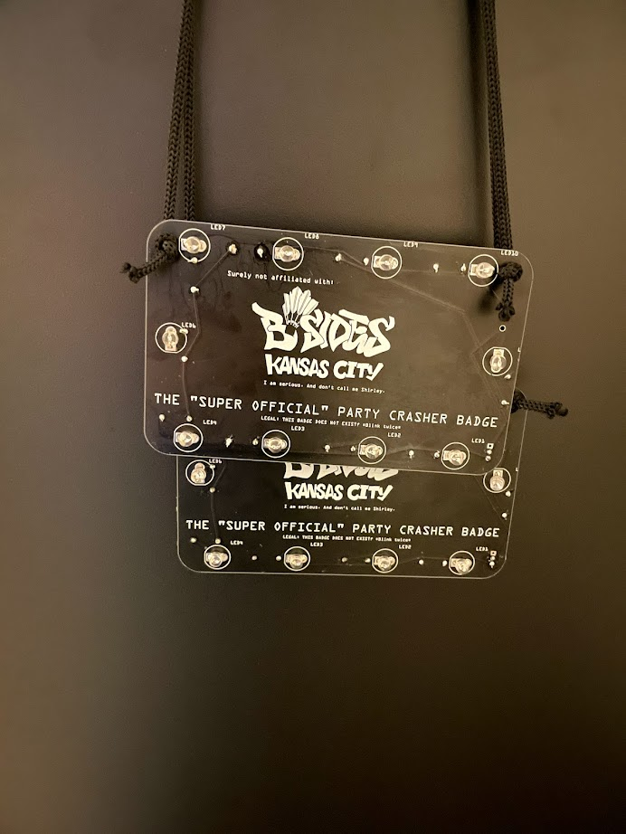

 # The "SUPER OFFICIAL" Party Crasher Badge for BSidesKC

 This is a Badge I came up with as a fun idea before BSidesKC 2021.

 

 There was a very limited run(5 badges) available at BSidesKC. 2022 will probably be something a bit more smart if I can secure a supply.

 ## Parts

 * [EDGELEC 100pcs 75 ohm Resistor 1/2w (0.5Watt) ±1% Tolerance Metal Film Fixed Resistor, Multiple Values of Resistance Optional](https://www.amazon.com/gp/product/B07QK7LBJ6/)
 * [Chanzon 100 pcs 5mm RGB Multicolor Slow Blinking (Multi Color Changing) Straw Hat LED Diode Lights (Clear Transparent Lens) Bright Lighting Bulb Lamps Electronics Components Light Emitting Diodes](https://www.amazon.com/gp/product/B01C19ENFA/)
 * [18650 Battery Clip 1 Slots 3.7V Plastic 18650 Battery Storage Box Case with Black and Red Wire Leads YOUCHENG for 18650 Battery with Connect Lead(5-Pack)](https://www.amazon.com/gp/product/B08LW24XND/)

 ## Notes on the BSidesKC 2021 run

 Of the 5 badges made, there was an issue with a short on the battery terminal, the likely cause of this was a mistake when adjusting which layer a silkscreen should've gone on. This version on github has been modified to resolve this issue.

 Due to that, the option of a switch on the board was removed as it was a suitable point to install the battery.
